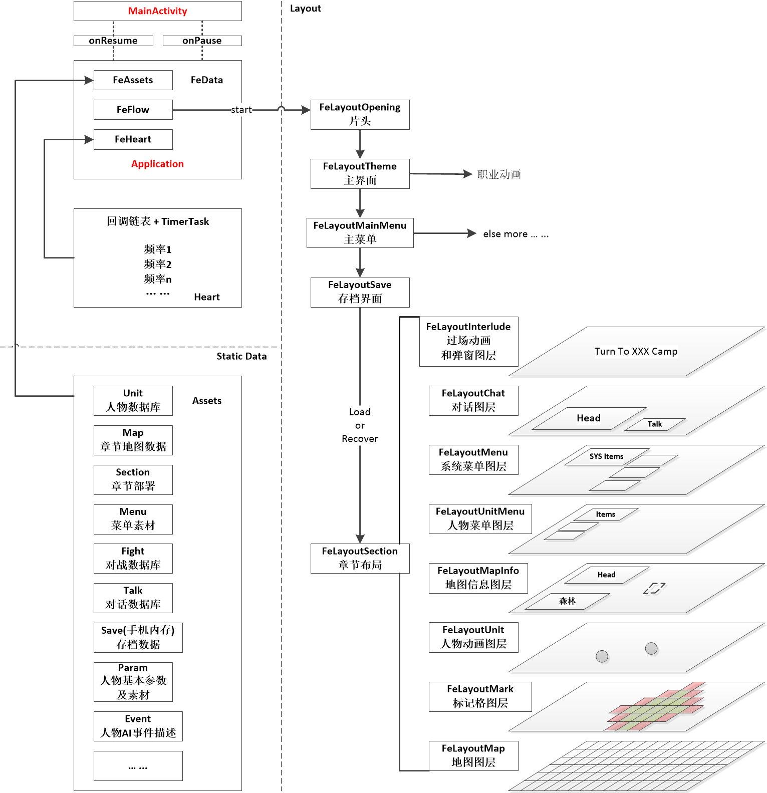

# FE For Android

## 文件结构

* FeData: 全局参数(Application)
* FeEvent: 流程事件切换
* FeHeart: 定时器+链表封装的定时任务工具,通过注册的方式为全局动画提供心跳
* FeHeartUnit: 注册心跳任务所使用的单元
* FeLayoutXXX: layout文件
* FeViewXXX: view文件
* FeParamXXX: 参数文件

## 结构总览

