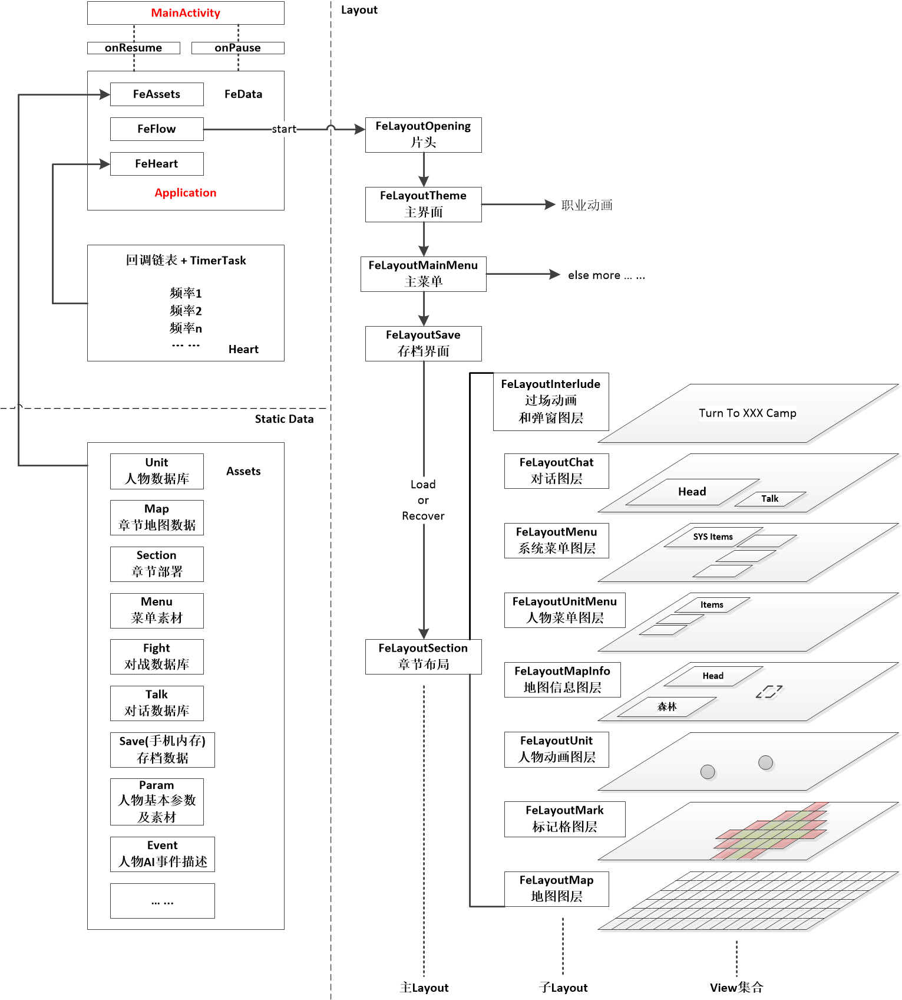

# FE For Android

## 文件结构

* FeAssetsXXX: assets文件资源管理类
* FeData: 全局参数(Application)
* FeEvent: 用户操作和当前状态
* FeFileXXX: FE定制assets文件读写管理类
* FeFlow: 流程事件切换
* FeHeart: 定时器+链表封装的定时任务工具,通过注册的方式为全局动画提供心跳
* FeHeartUnit: 注册心跳任务所使用的单元
* FeInfoXXX: 格子在地图上的位置信息、地图参数信息
* FeLayoutXXX: layout文件
* FePallet: bitmap调色板
* FeParamXXX: 参数文件
* FeReaderXXX: assets文件读取方法
* FeShader: 线性渲染(LinearGradient)数组,用于渲染标记方格
* FeViewXXX: view文件

## 结构总览

