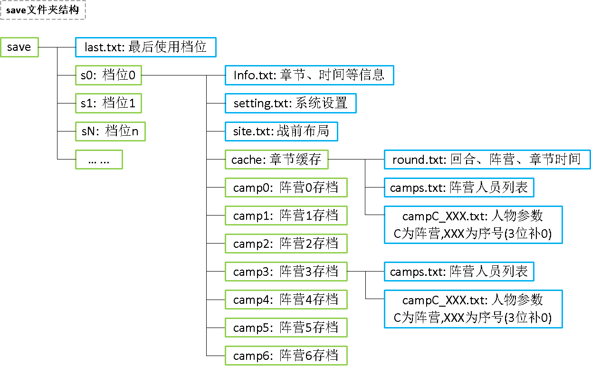

# save: 存档管理文件夹

## save/num.txt : 存档槽数量

* 格式: 文件就2个数字nn
* 示例:  03

## save/last.txt : 最后存档位置

* 格式: 文件就2个数字nn
* 示例:  00

# save/sX : 存档X文件夹

## save/sX/info.txt : 存档章节信息

* 关于是否中断: 0/加载存档时重新开始章节 1/恢复中断状态
* 格式:  章节;是否中断;总耗时;

## save/sX/setting.txt : 系统设置

* 格式:

## save/sX/site.txt : 当前章节己方人物站位(初始值从sectionXX/site.txt拷贝过来)

* 说明: 每行代表一个位置
* 关于固定位置: 只有指定的人物ID的人可以站位,0/任意人
* 关于人物ID: 默认站在这里的人物ID,0表示未指定
* 格式: 触发方式;出现回合;XY位置;固定位置;人物ID;
* 0;0;010010;0;0;

# save/sX/campC : 阵营人物存档

## save/sX/campC/camps.txt : 全人物清单

* 说明: 一行代表一个人物
* 格式: 阵营;人物序号;XY坐标(在地图时用,XY格式如003004,代表x=3,y=4);

## save/sX/campC/campC_XXX.txt 阵营人物数据结构,C为阵营,XXX为camps中的人物序号(不足3位补0,从0数起)

* 关于失能标记: 0/正常,1/该行作废(一般为人物死亡)
* 关于状态: 0/正常 1/中毒 2/睡眠 3/沉默 4/狂乱 5/无敌 444/死亡
* 关于救出状态: 0/无 1/救出 2/被救起
* 关于视野: 战争迷雾场地人物周边可视范围,不同职业不同,使用火把后有加成
* 
* 格式:
* 行0: 阵营;人物序号;人物id;失能标记;
* 行1: 是否待机;状态;level;exp;剩余hp;
* 行2: HP;力量;魔力;技术;速度;幸运;防御;魔防;体格;移动;
* 行3: HP;力量;魔力;技术;速度;幸运;防御;魔防;体格;移动; //add 加成
* 行4: 剑;枪;斧;弓;光;理;暗;仗熟练度;
* 行5: T1;T2;T3;T4;T5;T6;当前装备;
* 行6: S1;S2;S3;S4;
* 行7: 救出状态;救/被救起者序号;
* 行8: 战绩;战胜;战败;
* 行9: 视野;道具加成视野;
* 行10: 动向;指挥;

# save/sX/cache : 章节系统缓存信息

## save/sX/cache/round.txt : 当前回合、行动阵营、章节时间

* 关于序号: 人物载入地图时的序号,可用来匹配人物参数 campC_XXX.txt 及行动顺序
* 格式: 回合;阵营;人物序号;章节运行时长;

## save/sX/cache/camps.txt : 全阵营人物清单

* 同上面的 camps.txt 格式

## save/sX/cache/campC_XXX.txt : 人物参数

* 同上面的 campC_XXX.txt 格式

# save文件结构总览

